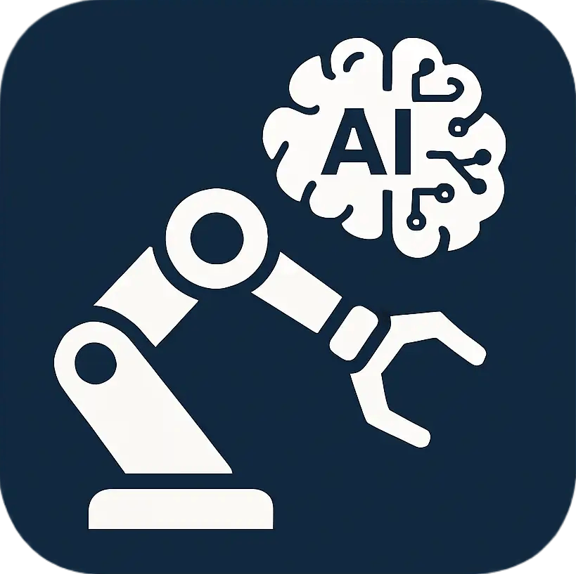

# Horizon 具身智能机械臂控制系统

<div align="center">



**一个集成AI智能决策、视觉识别、语音交互的6轴机械臂控制平台**

**让机械臂理解世界，用自然语言控制未来**

[](https://python.org)
[](LICENSE)
[](https://www.bilibili.com/video/BV13LkDBeEpy)
[](https://github.com/your-repo/Horizon_Arm)

[English](README_EN.md) | 简体中文

</div>

---

## 📺 视频教程

完整的系统介绍请观看：
- 🎬 [ Horizon具身智能机械臂系统](https://www.bilibili.com/video/BV13LkDBeEpy)

如果觉得项目对你有帮助，欢迎点赞👍、收藏⭐、投币🪙支持！

## 🎯 项目概述

Horizon 具身智能系统是一个功能完备的6轴机械臂控制平台，融合了现代AI技术与精密机械控制。系统通过自然语言指令、视觉识别、语音交互等多种方式，实现机械臂的智能化控制和操作。

如果这个项目对你有帮助，请给我一个⭐Star支持一下！

### ✨ 核心特性

- 🤖 **具身智能**: 基于LLM、VLM的自然语言理解和决策
- 👁️ **视觉系统**: 双目立体视觉、目标检测、深度估计
- 🎮 **数字孪生**: MuJoCo高精度物理仿真
- 🔧 **精密控制**: 基于CAN总线的高精度电机控制
- 🎤 **语音交互**: 语音识别(ASR)和语音合成(TTS)
- 📱 **现代界面**: PyQt5响应式用户界面

## 🏗️ 项目架构

```
Horizon_Arm_New/
├── 🧠 AI_SDK/                    # AI服务统一调用框架
│   ├── core/                     # 核心处理器
│   │   ├── llm/                  # 大语言模型处理
│   │   ├── asr/                  # 语音识别处理
│   │   ├── tts/                  # 语音合成处理
│   │   ├── multimodal/           # 多模态处理
│   │   ├── smart_chat/           # 智能对话
│   │   └── session/              # 会话管理
│   ├── providers/                # 多厂商适配层
│   │   ├── alibaba/              # 阿里云通义千问
│   │   └── deepseek/             # DeepSeek
│   └── services/                 # 服务封装层
│
├── ⚙️ Control_SDK/               # 电机控制核心SDK
│   └── Control_Core/             # 控制核心模块
│       ├── modules/              # 功能模块
│       │   ├── control_actions.py    # 控制动作
│       │   ├── read_parameters.py    # 参数读取
│       │   ├── modify_parameters.py  # 参数修改
│       │   ├── homing_commands.py    # 回零控制
│       │   └── trigger_actions.py    # 触发动作
│       ├── motor_controller_modular.py  # 模块化控制器
│       ├── can_interface.py      # CAN通信接口
│       └── commands.py           # 命令构建器
│
├── 🎯 core/                      # 核心算法模块
│   ├── arm_core/                 # 机械臂核心算法
│   │   ├── kinematics.py         # 运动学计算
│   │   ├── vision_detection.py   # 视觉检测
│   │   ├── Depth_Estimation.py   # 深度估计
│   │   ├── Hand_Eye_Calibration.py  # 手眼标定
│   │   ├── trajectory_executor.py    # 轨迹执行
│   │   └── rrt_planner.py        # 路径规划
│   └── embodied_core/            # 具身智能核心
│       ├── hierarchical_decision_system.py  # 分层决策系统
│       └── mujoco_kinematics_control_core.py  # MuJoCo控制
│
├── 🖥️ Main_UI/                   # 图形用户界面
│   ├── ui/                       # 界面组件
│   ├── widgets/                  # 功能控件
│   │   ├── digital_twin_widget.py       # 数字孪生
│   │   ├── teach_pendant_widget.py      # 示教器
│   │   ├── vision_grasp_widget.py       # 视觉抓取
│   │   ├── embodied_intelligence_widget.py  # 具身智能
│   │   └── connection_widget.py         # 连接管理
│   └── utils/                    # 工具模块
│
└── 📁 config/                    # 配置文件
    ├── aisdk_config.yaml         # AI SDK配置
    ├── motor_config.json         # 电机配置
    ├── embodied_config/          # 具身智能配置
    └── urdf/                     # 机器人模型文件
```

## 🚀 主要功能模块

### 1. 🧠 AI_SDK - 统一AI服务框架

AI_SDK提供了多厂商AI服务的统一调用接口，支持：

#### 🗣️ 大语言模型(LLM)
```python
from AI_SDK import AISDK

sdk = AISDK()

# 基础对话
response = sdk.chat("alibaba", "qwen-turbo", "你好")

# 流式输出
for chunk in sdk.chat("alibaba", "qwen-turbo", "讲个故事", stream=True):
    print(chunk, end="")

# 上下文对话
sdk.chat("alibaba", "qwen-turbo", "我叫张三", use_context=True)
name = sdk.chat("alibaba", "qwen-turbo", "我叫什么？", use_context=True)
```

#### 🎤 语音识别(ASR)
```python
# 文件识别
result = sdk.asr("alibaba", "file", audio_file="audio.wav")

# 麦克风识别
result = sdk.asr("alibaba", "microphone", duration=5)

# 实时流识别
for result in sdk.asr("alibaba", "stream", audio_stream=stream):
    print(result)

# 关键词唤醒
for result in sdk.asr("alibaba", "keyword", keywords=["你好", "小助手"]):
    if result.get("success"):
        print("检测到唤醒词:", result.get("keyword_detected"))
```

#### 🔊 语音合成(TTS)
```python
# 文本转语音文件
sdk.tts("alibaba", "file", "你好世界", output_file="output.mp3")

# 直接播放
sdk.tts("alibaba", "speaker", "欢迎使用AI系统")

# 流式合成
def text_generator():
    yield "今天天气"
    yield "很不错"

for chunk in sdk.tts("alibaba", "stream", text_generator()):
    print("合成完成一段")
```

#### 👁️ 多模态理解
```python
# 图像理解
result = sdk.multimodal("alibaba", "image", "描述这张图片", image_path="image.jpg")

# 视频分析
result = sdk.multimodal("alibaba", "video", "分析视频内容", video_path="video.mp4")

# 多图像分析
result = sdk.multimodal("alibaba", "multiple_images", "比较这些图片", 
                       image_paths=["img1.jpg", "img2.jpg"])
```

#### 🤖 智能对话(LLM + TTS)
```python
# 智能问答并语音播放
result = sdk.smart_chat(
    prompt="请介绍一下你自己",
    llm_provider="alibaba", 
    llm_model="qwen-turbo",
    tts_provider="alibaba",
    tts_mode="speaker"
)
```

**支持的AI服务商:**
- 🔵 **阿里云**: 通义千问系列模型
- 🟢 **DeepSeek**: DeepSeek系列模型
- 🔴 **OpenAI**: GPT系列模型(可扩展)

### 2. ⚙️ Control_SDK - 精密电机控制

Control_SDK提供了完整的ZDT闭环驱动板控制功能：

#### 🔧 基础控制
```python
from Control_SDK.Control_Core import ZDTMotorController

# 创建电机控制器
motor = ZDTMotorController(motor_id=1, port='COM18')

with motor:
    # 使能电机
    motor.control_actions.enable()
    
    # 位置控制
    motor.control_actions.move_to_position(90.0, speed=200)
    
    # 速度控制
    motor.control_actions.set_speed(100)
    
    # 力矩控制
    motor.control_actions.set_torque(500)  # 500mA
```

#### 🔄 多机同步控制
```python
# 创建多个电机控制器
broadcast = ZDTMotorController(motor_id=0, port='COM18')  # 广播控制器
motor1 = ZDTMotorController(motor_id=1, port='COM18')
motor2 = ZDTMotorController(motor_id=2, port='COM18')

# 共享CAN接口
broadcast.connect()
motor1.can_interface = broadcast.can_interface
motor2.can_interface = broadcast.can_interface

# 使能所有电机
motor1.control_actions.enable()
motor2.control_actions.enable()

# 配置同步运动(带同步标志)
motor1.control_actions.move_to_position(-3600, speed=1000, multi_sync=True)
motor2.control_actions.move_to_position_trapezoid(7200, max_speed=1000, 
                                                 acceleration=2000, multi_sync=True)

# 触发同步运动
broadcast.control_actions.sync_motion()
```

#### 📊 状态监控
```python
# 获取电机状态
status = motor.read_parameters.get_motor_status()
position = motor.read_parameters.get_position()
speed = motor.read_parameters.get_speed()
temperature = motor.read_parameters.get_temperature()
current = motor.read_parameters.get_current()

print(f"位置: {position:.2f}°, 速度: {speed:.2f}RPM, 温度: {temperature:.1f}°C")
```

#### 🏠 回零功能
```python
# 开始回零
motor.control_actions.start_homing()

# 等待回零完成
if motor.homing_commands.wait_for_homing_complete(timeout=30):
    print("回零成功")
else:
    print("回零超时")

# 设置当前位置为零点
motor.homing_commands.set_zero_position(save_to_chip=True)
```

**控制特性:**
- 🎯 **精确控制**: 位置精度±0.1°，速度精度±1RPM
- 🔄 **多种模式**: 位置模式、速度模式、力矩模式
- 🚀 **高速通信**: CAN总线500K波特率
- 🛡️ **安全保护**: 堵转保护、过温保护、限位保护

### 3. 🎯 核心算法模块

#### 🤖 运动学与轨迹规划
```python
from core.arm_core.kinematics import RobotKinematics

# 初始化运动学
kinematics = RobotKinematics()

# 正向运动学：关节角度 → 末端位姿
joint_angles = [0, 30, -45, 0, 15, 0]  # 度
end_pose = kinematics.forward_kinematics(joint_angles)

# 逆向运动学：末端位姿 → 关节角度
target_pose = [300, 200, 400, 0, 0, 0]  # [x,y,z,rx,ry,rz]
joint_solution = kinematics.inverse_kinematics(target_pose)

# 轨迹规划
from core.arm_core.trajectory_executor import TrajectoryExecutor
executor = TrajectoryExecutor()

# 关节空间轨迹
trajectory = executor.plan_joint_trajectory(start_joints, end_joints, duration=3.0)

# 笛卡尔空间轨迹
trajectory = executor.plan_cartesian_trajectory(start_pose, end_pose, duration=5.0)
```

#### 👁️ 视觉检测与深度估计
```python
from core.arm_core.vision_detection import VisionDetector
from core.arm_core.Depth_Estimation import StereoDepthEstimator

# 初始化视觉检测器
detector = VisionDetector(camera_matrix, dist_coeffs, model='fisheye')

# 颜色检测
hsv_lower = (35, 50, 50)   # HSV下限
hsv_upper = (85, 255, 255) # HSV上限
result = detector.detect_color(image, hsv_lower, hsv_upper, min_area=500)

# 双目深度估计
depth_estimator = StereoDepthEstimator()
depth_map = depth_estimator.compute_depth(left_image, right_image)

# 获取指定点的深度
x, y = 320, 240  # 像素坐标
depth = depth_estimator.get_depth_at_point(depth_map, x, y)
```

#### 🎯 手眼标定
```python
from core.arm_core.Hand_Eye_Calibration import HandEyeCalibrator

# 初始化标定器
calibrator = HandEyeCalibrator()

# 添加标定数据点
for i in range(num_poses):
    # 机械臂移动到标定位姿
    robot_pose = get_robot_pose(i)
    
    # 拍摄标定板图像
    image = capture_image()
    
    # 检测标定板
    success, camera_pose = calibrator.detect_calibration_board(image)
    
    if success:
        calibrator.add_calibration_data(robot_pose, camera_pose)

# 执行标定计算
success, transform_matrix = calibrator.calibrate()
if success:
    print("手眼标定成功")
    print(f"变换矩阵:\n{transform_matrix}")
```

### 4. 🧠 具身智能系统

具身智能系统实现了三层决策架构，支持自然语言控制：

#### 🎯 三层架构
```
┌─────────────────────────────────────────────────────────────┐
│                    高层决策器 (High-Level Planner)           │
│  - 与LLM交互进行函数选择                                      │
│  - 将自然语言指令转换为函数调用JSON                           │
│  - 智能选择合适函数和参数                                     │
└─────────────────────┬───────────────────────────────────────┘
                      │ Function Call JSON
                      ▼
┌─────────────────────────────────────────────────────────────┐
│                   中层任务解析器 (Middle-Level Parser)        │
│  - 解析高层返回的函数调用JSON                                │
│  - 直接调用指定函数并传递参数                                 │
│  - 处理函数执行结果和错误                                     │
└─────────────────────┬───────────────────────────────────────┘
                      │ Function Execution
                      ▼
┌─────────────────────────────────────────────────────────────┐
│                   底层执行器 (Low-Level Executor)            │
│  - 具体的机械臂控制函数                                       │
│  - MuJoCo仿真控制函数                                        │
│  - 视觉处理和抓取函数                                         │
└─────────────────────────────────────────────────────────────┘
```

#### 🗣️ 自然语言控制
```python
from core.embodied_core.hierarchical_decision_system import HierarchicalDecisionSystem

# 初始化决策系统
decision_system = HierarchicalDecisionSystem(
    provider="alibaba",
    model="qwen-turbo", 
    control_mode="both"  # 同时控制真实机械臂和仿真
)

# 自然语言指令控制
instructions = [
    "机械臂回到初始位置",
    "将第一个关节转动30度",
    "移动到坐标(300, 200, 400)",
    "抓取红色的物体",
    "执行一个挥手动作"
]

for instruction in instructions:
    result = decision_system.execute_instruction(instruction)
    print(f"指令: {instruction}")
    print(f"执行结果: {result['execution_result']['success']}")
```

#### 🎮 MuJoCo仿真集成
```python
# MuJoCo仿真控制
from core.embodied_core import embodied_mujoco_func

# 启动MuJoCo仿真
embodied_mujoco_func.start_mujoco_simulation()

# 控制仿真机械臂
embodied_mujoco_func.move_to_joint_angles([0, 30, -45, 0, 15, 0])
embodied_mujoco_func.move_to_position([300, 200, 400, 0, 0, 0])

# 预设动作
embodied_mujoco_func.wave_hand()
embodied_mujoco_func.home_position()
```

### 5. 🖥️ 图形用户界面

基于PyQt5的现代化界面，提供直观的操作体验：

#### 🦾 机械臂控制界面
- **数字孪生**: 实时3D仿真显示
- **关节控制**: 独立控制每个关节
- **坐标控制**: 笛卡尔坐标系控制
- **状态监控**: 实时显示电机状态

#### 🎮 示教器界面
- **关节模式**: 直接控制关节角度
- **基座模式**: 基于基座坐标系
- **工具模式**: 基于末端工具坐标系
- **程序录制**: 录制和回放运动序列

#### 👁️ 视觉抓取界面
- **相机显示**: 实时相机图像显示
- **深度图**: 双目深度信息可视化
- **目标检测**: AI目标识别和标注
- **坐标转换**: 像素坐标到机械臂坐标

#### 🧠 具身智能界面
- **语音交互**: 语音指令输入和反馈
- **文本对话**: 自然语言文本交互
- **任务队列**: 批量任务管理和执行
- **执行日志**: 详细的执行过程记录

## 📋 系统要求

### 硬件要求
- **机械臂**: 6轴机械臂 + ZDT闭环驱动板
- **通信设备**: CANable、CANtact或其他SLCAN兼容设备
- **相机**: USB摄像头或工业相机(可选)
- **计算机**: Windows 10/11, 8GB+ RAM, 支持OpenGL

### 软件依赖
- **Python**: 3.8+
- **GUI框架**: PyQt5
- **仿真环境**: MuJoCo >= 2.3.0
- **计算机视觉**: OpenCV >= 4.10.0
- **数值计算**: NumPy, SciPy, Matplotlib
- **AI服务**: 网络连接(使用LLM功能时)

## 🚀 快速开始

### 1. 环境安装
```bash
# 克隆项目
git clone https://github.com/your-repo/Horizon_Arm_New.git
cd Horizon_Arm_New

# 安装依赖
pip install -r requirements.txt

# Windows系统安装pyaudio
pip install pipwin
pipwin install pyaudio
```

### 2. 配置设置
```bash
# 复制配置文件模板
cp config/aisdk_config.yaml.template config/aisdk_config.yaml

# 编辑配置文件，设置API密钥
# 建议使用环境变量设置密钥
export ALI_API_KEY="your_alibaba_api_key"
export DEEPSEEK_API_KEY="your_deepseek_api_key"
```

### 3. 硬件连接
1. 连接ZDT驱动板到CAN总线
2. 连接CANable设备到计算机USB端口
3. 设置驱动板参数：
   - P_Serial: CAN1_MAP
   - CAN速率: 500K
   - 电机ID: 1-6(每个电机唯一)

### 4. 启动系统
```bash
# 启动图形界面
python run_gui.py

# 或直接运行主程序
python Main_UI/main.py
```

### 5. 基础使用

#### 连接电机
1. 打开"连接管理"界面
2. 选择正确的串口(如COM18)
3. 点击"连接"按钮
4. 等待电机连接成功

#### 控制机械臂
1. 切换到"机械臂"标签页
2. 使用关节控制滑块调整各关节角度
3. 或使用坐标输入框设置目标位置
4. 观察MuJoCo仿真中的实时反馈

#### 自然语言控制
1. 切换到"具身智能"标签页
2. 配置LLM提供商和模型
3. 在指令输入框中输入自然语言指令
4. 点击"执行指令"或使用语音输入

## 🔧 配置说明

### AI_SDK配置 (config/aisdk_config.yaml)
```yaml
providers:
  alibaba:
    api_key: ${ALI_API_KEY}  # 使用环境变量
    default_params:
      max_tokens: 2000
      temperature: 0.7
      top_p: 0.8
    enabled: true
    
  deepseek:
    api_key: ${DEEPSEEK_API_KEY}
    default_params:
      max_tokens: 2000
      temperature: 0.7
      top_p: 1.0
    enabled: true

logging:
  level: INFO
  file: AI_SDK.log
  max_size: 10485760  # 10MB
  backup_count: 5

session:
  default_max_history: 20
  max_sessions: 100
```

### 电机配置 (config/motor_config.json)
```json
{
  "motors": {
    "1": {
      "name": "基座关节",
      "reducer_ratio": 50.0,
      "direction": 1,
      "min_angle": -180,
      "max_angle": 180
    },
    "2": {
      "name": "肩部关节", 
      "reducer_ratio": 50.0,
      "direction": -1,
      "min_angle": -90,
      "max_angle": 90
    }
    // ... 其他电机配置
  },
  "communication": {
    "port": "COM18",
    "baudrate": 500000,
    "timeout": 1.0
  }
}
```

## 🛠️ 开发指南

### 扩展AI功能
```python
# 添加新的AI服务商
# 1. 在AI_SDK/providers/目录下创建新的提供商模块
# 2. 实现LLMProvider基类
# 3. 在配置文件中添加提供商配置

class NewAIProvider(LLMProvider):
    def __init__(self, config):
        super().__init__(config)
        
    def chat(self, model, messages, **kwargs):
        # 实现聊天接口
        pass
        
    def stream_chat(self, model, messages, **kwargs):
        # 实现流式聊天接口
        pass
```

### 添加新的控制功能
```python
# 扩展电机控制功能
# 在Control_SDK/Control_Core/modules/目录下添加新模块

class CustomControlModule:
    def __init__(self, controller):
        self.controller = controller
        
    def custom_motion(self, params):
        # 实现自定义运动控制
        command = self.controller.command_builder.build_custom_command(params)
        return self.controller._send_command(command)
```

### 添加视觉算法
```python
# 扩展视觉检测功能
# 在core/arm_core/目录下添加新的视觉算法

class CustomVisionAlgorithm:
    def __init__(self):
        pass
        
    def detect_custom_object(self, image):
        # 实现自定义目标检测
        return detection_result
```

## 🔍 故障排除

### 常见问题

#### 1. 连接失败
**问题**: 无法连接到电机控制器
**解决方案**:
- 检查串口号是否正确(设备管理器)
- 确认没有其他程序占用串口
- 检查CAN总线连接和供电
- 验证驱动板参数设置

#### 2. AI功能无法使用
**问题**: LLM调用失败或超时
**解决方案**:
- 检查网络连接
- 验证API密钥是否正确
- 确认API配额是否充足
- 检查防火墙设置

#### 3. 视觉功能异常
**问题**: 摄像头无法打开或图像异常
**解决方案**:
- 检查摄像头连接和驱动
- 验证摄像头权限设置
- 检查OpenCV版本兼容性
- 确认相机标定参数

#### 4. MuJoCo仿真问题
**问题**: 仿真无法启动或显示异常
**解决方案**:
- 检查MuJoCo许可证
- 验证OpenGL支持
- 检查URDF模型文件
- 确认显卡驱动更新

### 调试模式
```python
# 启用详细日志
from Control_SDK.Control_Core import setup_logging
import logging

setup_logging(logging.DEBUG)

# 启用AI_SDK调试
os.environ['AISDK_DEBUG'] = '1'
```

## 📚 API文档

详细的API文档请参考：
- [AI_SDK API文档](AI_SDK/README.md)
- [Control_SDK API文档](Control_SDK/README.md)
- [具身智能系统文档](core/embodied_core/README.md)

## 📜 开源许可与商用声明

### 开源许可
本项目采用 **MIT License** 开源协议，你可以自由地：
- ✅ 使用本项目进行学习和研究
- ✅ 修改源代码并分发
- ✅ 用于个人或商业项目
- ✅ 私有化部署

### ⚠️ 商用声明（重要）

**如果你将本项目用于商业用途，请遵守以下要求：**

1. **注明出处**：在你的产品、文档或宣传材料中明确标注：
   ```
   本项目基于 Horizon 具身智能机械臂控制系统
   原项目地址：https://github.com/xaio6/Embodied_AI_Arm_open
   原作者B站：https://space.bilibili.com/xxxxx
   ```

2. **保留版权信息**：不要移除源代码中的版权声明和许可证文件

3. **禁止冒充原创**：不得声称本项目的全部或部分代码为你的原创作品

4. **鼓励反馈**：如果基于本项目开发了有趣的应用，欢迎联系原作者分享

**违反以上声明的商用行为，将保留追究法律责任的权利。**

### 免责声明
- 本软件按"原样"提供，不提供任何明示或暗示的保证
- 使用本软件产生的任何直接或间接损失，作者不承担责任
- 请确保在安全的环境下操作机械臂，注意人身和设备安全

## 🤝 贡献指南

欢迎所有形式的贡献！无论是报告bug、提出新功能建议，还是提交代码改进。

### 如何贡献

1. **Fork** 本仓库
2. 创建你的特性分支 (`git checkout -b feature/AmazingFeature`)
3. 提交你的改动 (`git commit -m 'Add some AmazingFeature'`)
4. 推送到分支 (`git push origin feature/AmazingFeature`)
5. 开启一个 **Pull Request**

### 贡献内容
- 🐛 Bug修复和问题报告
- ✨ 新功能开发
- 📝 文档改进和翻译
- 🎨 UI/UX优化
- ⚡ 性能优化
- 🧪 测试用例补充

### 代码规范
- 遵循PEP 8 Python代码风格
- 添加必要的注释和文档字符串
- 提交前运行测试确保代码可用
- Pull Request中清晰描述改动内容


<div align="center">

### **Horizon 具身智能机械臂控制系统**

*让机械臂更智能，让控制更简单*

**如果觉得项目有帮助，请点个⭐Star支持一下！**

Made with ❤️ by Horizon AI Lab

</div>
